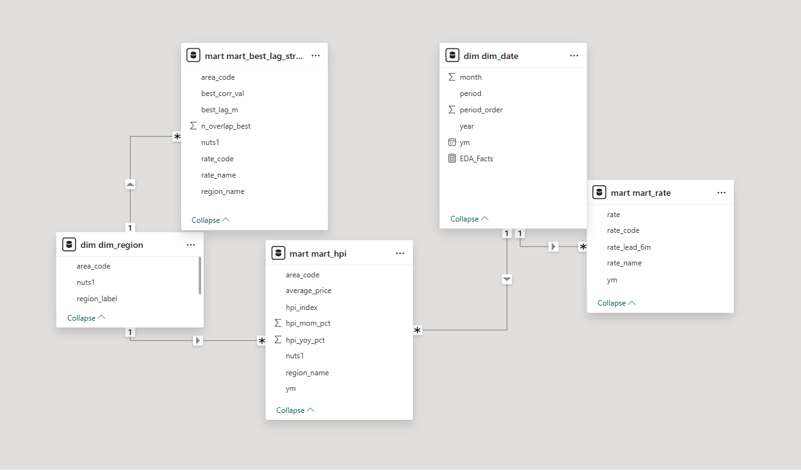
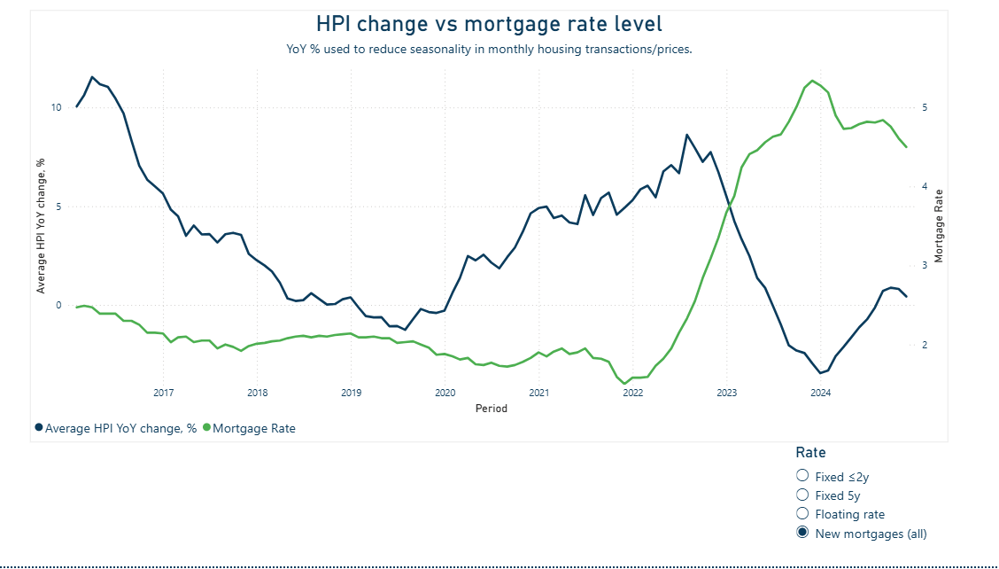

# SQL-PBI-hpi-mortgage-lags
End-to-end analysis of UK housing prices and mortgage rates using SQL data marts and Power BI. Includes feature engineering, lagged correlation, and regional insights. Visualizes key analytical findings with reproducible data and SQL pipeline.
---

## 📂 Project Structure

- /sql/ -- SQL scripts for dim, stg, raw, marts
- /data/ -- Input datasets, snapshot CSVs for reproducibility
- /pbi/ -- Power BI * .pbix file,  * .csv snapshots, * . json files for colour scheme and London topography
- /docs/ -- Project brief and all key visualizations/images

---

## 🔍 Project Overview

- **Goal:** Explore the relationship between UK house price growth and mortgage rates across time and regions, using SQL feature engineering and Power BI analytics.
- **Approach:**  
  - Build reproducible marts in PostgreSQL (see `/sql/`)
  - Engineer features: YoY HPI %, lagged mortgage rates, best-lag selection per region/rate
  - Analyze regional and temporal patterns, including exogenous shocks (Brexit, Covid, Ukraine war)
  - Visualize insights with interactive dashboards and regional maps in Power BI

---

## 🚀 Quickstart (Reproducibility)

1. **Data:**  
   - Download sample source data from `/data/`
   - Or use the included snapshot marts (`/data/snapshots/`) to reproduce Power BI visuals without database access

2. **SQL Pipeline:**  
   - See `/sql/` for all scripts to build raw, staging, dimensional and mart tables/views in PostgreSQL Server environment

3. **Power BI Dashboard:**  
   - Open `/pbi/UK_HPI_Mortgage_Lag_LIVE.pbix`
   - PBIX visuals use only marts and snapshot CSVs for reproducibility

---

## 🖼️ Key Visualizations

Can easily be extended to England or UK regions: simply copy the dashboard, replace the Shape Map with a Filled Map, and filter by region.

---

## 📊 Key Analytical Findings

- Lagged inverse relationship between mortgage rates and HPI YoY growth
- Dominant transmission lag ≈ 6 months across most regions (shorter for Scotland, diverse for London)
- Major exogenous shocks (Covid, Ukraine war) caused structural breaks, with marked divergence in Central London
- See `/docs/Key_Analytical_Findings.png` for the summary card view

---

## 📄 Documentation

- **Project Brief:** [`/docs/Project Brief.md`](docs/Project%20Brief.md)
- **All key visuals:** `/docs/`
- **Power BI file:** `/pbi/UK_HPI_Mortgage_Lag_LIVE.pbix`
- **SQL pipeline:** `/sql/`
- **Snapshot marts:** `/data/snapshots/`

---

## 🔁 Reproducibility & Deliverables

- All marts/views used in analysis are provided as CSV snapshots in `/data/snapshots/`
- Power BI dashboard can be refreshed using these static marts (no DB connection required)
- SQL scripts can be run end-to-end on any PostgreSQL 14+ instance
- `/pbi/Prussian_YIGn_theme.json`  
  Custom Power BI color theme (Prussian blue–yellow–green).
- `/json/london-topojson.json`  
  Detailed London boroughs TopoJSON for Power BI geospatial visualizations.
---

## 📢 About

Created by [Natalja Talikova](https://github.com/NataljaTalikova)  
MSc Quantitative Finance with Data Science, University of London

---

## 📜 License

This project is licensed under the MIT License.
